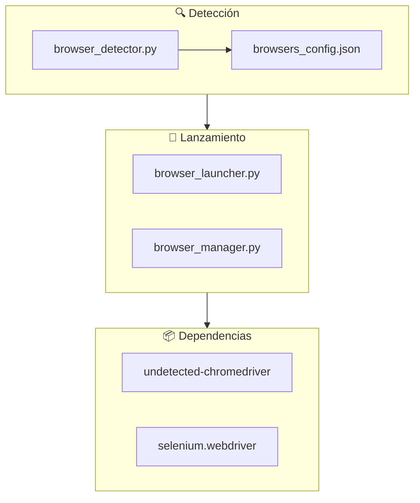
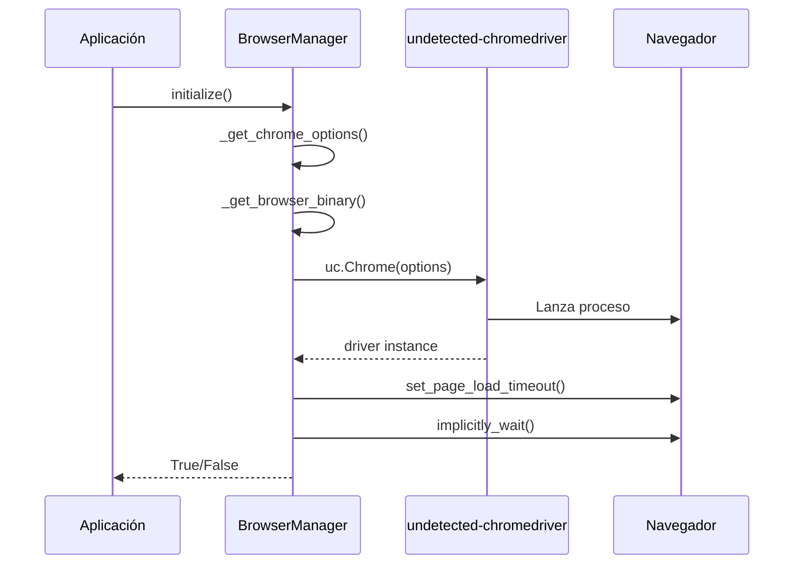
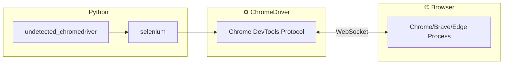

# Browser Launcher - Reporte Técnico Completo

## 1. Arquitectura Actual del Proyecto

### Componentes Principales



| Archivo | Líneas | Función |
|---------|--------|---------|
| [browser_detector.py](file:///c:/Users/Usuario/Documents/LEO/auto_Forms2/src/core/browser_automation/browser_detector.py) | 181 | Detecta navegadores instalados sin abrir ventanas |
| [browser_launcher.py](file:///c:/Users/Usuario/Documents/LEO/auto_Forms2/src/core/browser_automation/browser_launcher.py) | 75 | Lanzador simplificado con `undetected-chromedriver` |
| [browser_manager.py](file:///c:/Users/Usuario/Documents/LEO/auto_Forms2/src/core/browser_automation/browser_manager.py) | 351 | Gestor completo con anti-detección, timeouts y monitoreo |
| [browsers_config.json](file:///c:/Users/Usuario/Documents/LEO/auto_Forms2/src/core/browser_automation/browsers_config.json) | 49 | Configuración JSON de rutas y user-data-dir |

---

## 2. Flujo de Lanzamiento



---

## 3. Configuraciones Selenium Actuales

### Opciones Anti-Detección (Implementadas)

```python
# En browser_manager.py líneas 148-171
options.add_argument("--disable-blink-features=AutomationControlled")
options.add_argument("--disable-infobars")
options.add_argument("--disable-dev-shm-usage")
options.add_argument("--no-first-run")
options.add_argument("--no-service-autorun")
options.add_argument("--password-store=basic")
options.add_argument("--disable-extensions")
options.add_argument(f"--window-size={width},{height}")
options.add_argument("--incognito")  # Si self.incognito=True
options.add_argument("--disable-gpu")  # Si BROWSER_SETTINGS["disable_gpu"]=True
```

### Timeouts Configurados

| Tipo | Valor| Ubicación |
|------|------|-----------|
| Page Load | 120s (configurable) | `browser_manager.py:202` |
| Implicit Wait | 5s | `browser_manager.py:206` |
| Element Wait | 10s | `TIMEOUTS["element_wait"]` |
| Login Wait | 300s | `TIMEOUTS["login_wait"]` |

### Parámetros `uc.Chrome()`

```python
uc.Chrome(
    options=options,
    headless=False,      # BROWSER_SETTINGS["headless"]
    use_subprocess=True  # Siempre True
)
```

---

## 4. Opciones de Lanzamiento Disponibles

### 4.1 Modos de Sesión

| Modo | Flag Chrome | Descripción |
|------|-------------|-------------|
| **Normal** | (ninguno) | Sesión con perfil de usuario |
| **Incognito** | `--incognito` | Sin cookies/historial, limpia al cerrar |
| **Nueva Ventana** | `--new-window` | Fuerza nueva ventana (no tab) |
| **User-Data-Dir** | `--user-data-dir=PATH` | Usar perfil específico |

### 4.2 Gestión de Cookies/Cache

| Acción | Método |
|--------|--------|
| Sin cookies | `--incognito` o eliminar `user-data-dir` |
| Limpiar cache | Usar perfil temporal o `driver.delete_all_cookies()` |
| Cache en memoria | `--disk-cache-size=0` |
| Perfil limpio | `options.add_argument("--user-data-dir=/tmp/temp_profile")` |

---

## 5. Optimización de Recursos (RAM/CPU/GPU)

### 5.1 Flags de Reducción de RAM

```python
# Reducir consumo de memoria
"--disable-dev-shm-usage"           # Evita /dev/shm en Linux
"--disable-extensions"              # Sin extensiones
"--disable-plugins"                 # Sin plugins
"--disable-background-networking"   # Sin networking en background
"--disable-sync"                    # Sin sincronización
"--disable-translate"               # Sin traductor
"--memory-pressure-off"             # Gestión de memoria
"--single-process"                  # Proceso único (riesgoso)
"--renderer-process-limit=1"        # Limitar procesos renderer
```

### 5.2 Flags de Reducción de CPU

```python
# Reducir uso de CPU
"--disable-crash-reporter"          # ~20% menos CPU
"--disable-logging"                 # Sin logs
"--log-level=3"                     # Solo errores fatales
"--silent"                          # Modo silencioso
"--disable-background-timer-throttling"
"--disable-backgrounding-occluded-windows"
"--disable-renderer-backgrounding"
"--disable-component-update"        # Sin updates de componentes
```

### 5.3 Flags de GPU

| Flag | Efecto |
|------|--------|
| `--disable-gpu` | Desactiva aceleración GPU (útil en headless/VMs) |
| `--disable-gpu-compositing` | Solo composición sin GPU |
| `--disable-software-rasterizer` | Sin rasterizado software |
| `--ignore-gpu-blocklist` | Forzar uso de GPU bloqueada |
| `--disable-gpu-sandbox` | Deshabilitar sandbox GPU |

---

## 6. Deshabilitar Recursos Web

### 6.1 Imágenes

```python
# Método 1: Blink settings
options.add_argument("--blink-settings=imagesEnabled=false")

# Método 2: Experimental options
prefs = {"profile.managed_default_content_settings.images": 2}
options.add_experimental_option("prefs", prefs)
```

### 6.2 CSS y Animaciones

```python
# Deshabilitar animaciones CSS
options.add_argument("--disable-animations")
options.add_argument("--animation-duration-scale=0")

# Reducir rendering
options.add_argument("--disable-smooth-scrolling")
options.add_argument("--disable-threaded-scrolling")
```

### 6.3 JavaScript (Precaución)

```python
# NO recomendado para sitios modernos
prefs = {"profile.managed_default_content_settings.javascript": 2}
options.add_experimental_option("prefs", prefs)
```

### 6.4 Fonts

```python
options.add_argument("--disable-remote-fonts")
```

---

## 7. Modo Headless

### Variantes

| Flag | Chrome | Descripción |
|------|--------|-------------|
| `--headless` | <112 | Headless legacy |
| `--headless=new` | ≥112 | Headless moderno (recomendado) |
| `--headless=chrome` | Alternativo | Igual que `new` |

### Optimización Headless

```python
options.add_argument("--headless=new")
options.add_argument("--disable-gpu")
options.add_argument("--no-sandbox")
options.add_argument("--disable-dev-shm-usage")
options.add_argument("--window-size=1280,800")  # Menor resolución
```

> [!IMPORTANT]
> El modo headless reduce **~30% RAM/CPU** pero algunos sitios lo detectan.

---

## 8. Configuración por Navegador

### Chrome/Chromium

```python
# Compatible con undetected-chromedriver
uc.ChromeOptions()
```

### Edge (Chromium)

```python
# Requiere EdgeOptions y msedgedriver
from selenium.webdriver.edge.options import Options as EdgeOptions
options = EdgeOptions()
options.use_chromium = True
options.binary_location = "msedge.exe"
```

### Brave

```python
# Usar ChromeOptions con binary_location
options = uc.ChromeOptions()
options.binary_location = r"C:\...\brave.exe"
```

### Firefox

```python
# Motor diferente: GeckoDriver
from selenium.webdriver.firefox.options import Options as FirefoxOptions
from selenium.webdriver.firefox.service import Service as FirefoxService

options = FirefoxOptions()
options.add_argument("--headless")
options.set_preference("permissions.default.image", 2)  # Sin imágenes
```

> [!WARNING]
> `undetected-chromedriver` **SOLO** soporta navegadores Chromium. Firefox requiere GeckoDriver nativo.

---

## 9. Cold Start Optimization

### Reducir Tiempo de Arranque

```python
# Bundle óptimo para inicio en frío
COLD_START_OPTIONS = [
    "--no-first-run",
    "--no-default-browser-check",
    "--disable-default-apps",
    "--disable-popup-blocking",
    "--disable-extensions",
    "--disable-sync",
    "--disable-translate",
    "--disable-background-networking",
    "--disable-client-side-phishing-detection",
    "--disable-hang-monitor",
    "--disable-prompt-on-repost",
    "--metrics-recording-only",
    "--safebrowsing-disable-auto-update",
    "--password-store=basic",
]
```

### Pre-caching de Driver

```python
# Descargar chromedriver antes de usar
import undetected_chromedriver as uc
uc.install()  # Pre-descarga el driver
```

---

## 10. Configuración Recomendada Completa

### Modo Máxima Eficiencia

```python
def get_performance_options():
    options = uc.ChromeOptions()
    
    # === RECURSOS ===
    options.add_argument("--disable-gpu")
    options.add_argument("--disable-dev-shm-usage")
    options.add_argument("--disable-extensions")
    options.add_argument("--disable-plugins")
    options.add_argument("--disable-software-rasterizer")
    options.add_argument("--disable-crash-reporter")
    options.add_argument("--disable-logging")
    options.add_argument("--log-level=3")
    
    # === COLD START ===
    options.add_argument("--no-first-run")
    options.add_argument("--no-default-browser-check")
    options.add_argument("--disable-default-apps")
    options.add_argument("--disable-sync")
    options.add_argument("--disable-translate")
    options.add_argument("--disable-background-networking")
    
    # === IMÁGENES/MEDIA ===
    options.add_argument("--blink-settings=imagesEnabled=false")
    prefs = {
        "profile.managed_default_content_settings.images": 2,
        "profile.default_content_setting_values.notifications": 2,
    }
    options.add_experimental_option("prefs", prefs)
    
    # === ANTI-DETECCIÓN ===
    options.add_argument("--disable-blink-features=AutomationControlled")
    options.add_argument("--disable-infobars")
    
    return options
```

### Modo Balance (Rendimiento + Funcionalidad)

```python
def get_balanced_options():
    options = uc.ChromeOptions()
    
    options.add_argument("--disable-extensions")
    options.add_argument("--disable-dev-shm-usage")
    options.add_argument("--no-first-run")
    options.add_argument("--disable-sync")
    options.add_argument("--disable-translate")
    options.add_argument("--disable-blink-features=AutomationControlled")
    options.add_argument("--disable-infobars")
    options.add_argument("--disable-crash-reporter")
    # Mantiene imágenes para validación visual
    
    return options
```

---

## 11. Tabla Resumen de Flags

| Flag | RAM | CPU | GPU | Cold Start | Riesgo |
|------|:---:|:---:|:---:|:----------:|:------:|
| `--headless=new` | ⬇️ | ⬇️ | ⬇️ | ⬇️ | Detección |
| `--disable-gpu` | ⬇️ | - | ⬇️⬇️ | ⬇️ | Bajo |
| `--disable-extensions` | ⬇️ | ⬇️ | - | ⬇️ | Ninguno |
| `--blink-settings=imagesEnabled=false` | ⬇️⬇️ | ⬇️ | - | ⬇️ | Funcional |
| `--incognito` | - | - | - | - | Ninguno |
| `--disable-crash-reporter` | - | ⬇️⬇️ | - | ⬇️ | Ninguno |
| `--no-sandbox` | ⬇️ | ⬇️ | - | ⬇️ | ⚠️ Seguridad |
| `--single-process` | ⬇️⬇️ | ⬇️ | - | ⬇️⬇️ | ⚠️ Estabilidad |
| `--disable-dev-shm-usage` | ⬇️ | - | - | - | Linux only |

---

## 12. Integración Python ↔ Navegador



### Comunicación

1. **Python** → `undetected-chromedriver` parchea selenium para evitar detección
2. **Selenium** → Inicia `chromedriver.exe` como subproceso
3. **ChromeDriver** → Comunica via **CDP (Chrome DevTools Protocol)** por WebSocket
4. **Browser** → Ejecuta comandos y retorna resultados

---

## 13. Limitaciones Actuales del Proyecto

| Limitación | Estado |
|------------|--------|
| Solo Chromium-based | ✅ Correcto |
| Firefox no soportado | ⚠️ En config pero no funcional |
| Sin perfil personalizado | ⚠️ `user_data_dir` no usado |
| Sin optimización recursos | ⚠️ Solo básico |
| Sin modo headless configurable | ⚠️ Hardcoded `False` |
