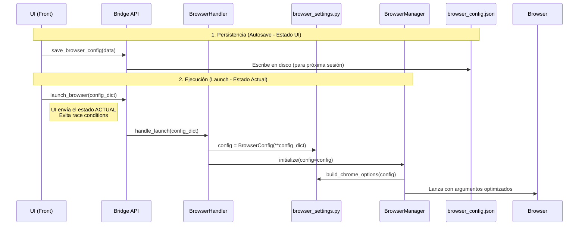

# Browser Settings - Arquitectura Completamente Detallada

## Flujo de Datos



---

## 1. `src/core/browser_automation/browser_settings.py` (FUENTE DE VERDAD)

Este archivo contendrá **TODAS** las definiciones detalladas del reporte.

```python
"""
Browser Settings - Configuración Centralizada
Define perfiles, flags y utilidades para generar ChromeOptions.
"""
from dataclasses import dataclass, field, asdict
from typing import Dict, List, Optional, Any
import undetected_chromedriver as uc

# ============================================================
# DATACLASS PRINCIPAL (Serializable)
# ============================================================
@dataclass
class BrowserConfig:
    """Configuración completa - Serializable y editable desde UI."""
    
    # === PERFIL BASE ===
    efficiency_profile: str = "efficiency"  # normal|balanced|efficiency|extreme
    
    # === FLAGS INDIVIDUALES (Sobrescriben perfil) ===
    gpu_enabled: bool = True
    images_enabled: bool = True
    animations_enabled: bool = True
    extensions_enabled: bool = False
    
    # === COLD START & PERFORMANCE ===
    cold_start_optimization: bool = True
    page_load_timeout: int = 30
    element_wait_timeout: int = 10
    implicit_wait: int = 5
    
    # === SESIÓN & APARIENCIA ===
    headless: bool = False
    incognito: bool = False
    window_width_min: int = 1200
    window_width_max: int = 1400
    window_height_min: int = 800
    window_height_max: int = 1000
    
    # === ANTI-DETECCIÓN (Habilitados por defecto) ===
    anti_detection_enabled: bool = True
    mock_webdriver: bool = True
    randomize_window_size: bool = True
    exclude_automation_switches: bool = True
    disable_webrtc_leak: bool = True
    spoof_plugins: bool = True

# ============================================================
# DETALLE DE PERFILES (Diccionarios Estáticos)
# ============================================================
EFFICIENCY_PROFILES = {
    "normal": {
        "description": "Sin optimizaciones - máxima compatibilidad",
        "description_detail": "Carga todo: imágenes, animaciones, extensiones.",
        "args": [],
        "prefs": {},
    },
    "balanced": {
        "description": "Optimización moderada",
        "description_detail": "Desactiva sincronización, traducción y networking en background.",
        "args": [
            "--disable-sync",
            "--disable-translate",
            "--disable-background-networking",
            "--disable-dev-shm-usage",
        ],
        "prefs": {
            "profile.default_content_setting_values.notifications": 2,
        },
    },
    "efficiency": {  # RECOMENDADO
        "description": "Máxima eficiencia sin sacrificar validación visual",
        "description_detail": "Desactiva logs, reporte de crashes, animaciones innecesarias, audio.",
        "args": [
            "--disable-dev-shm-usage",
            "--disable-crash-reporter",
            "--disable-logging",
            "--log-level=3",
            "--disable-background-networking",
            "--disable-sync",
            "--disable-translate",
            "--disable-default-apps",
            "--disable-hang-monitor",
            "--disable-prompt-on-repost",
            "--metrics-recording-only",
            "--mute-audio",
            "--disable-extensions",
            "--disable-component-update",
        ],
        "prefs": {
            "profile.default_content_setting_values.notifications": 2,
        },
    },
    "extreme": {
        "description": "Máxima eficiencia - sin imágenes ni animaciones",
        "description_detail": "TODO desactivado. Sin GPU, sin imágenes, sin fuentes remotas.",
        "args": [
            "--disable-gpu",
            "--disable-software-rasterizer",
            "--disable-dev-shm-usage",
            "--disable-crash-reporter",
            "--disable-logging",
            "--log-level=3",
            "--disable-background-networking",
            "--disable-sync",
            "--disable-translate",
            "--disable-default-apps",
            "--disable-hang-monitor",
            "--disable-prompt-on-repost",
            "--metrics-recording-only",
            "--mute-audio",
            "--disable-smooth-scrolling",
            "--disable-animations",
            "--animation-duration-scale=0",
            "--blink-settings=imagesEnabled=false",
            "--disable-remote-fonts",
            "--disable-extensions",
        ],
        "prefs": {
            "profile.managed_default_content_settings.images": 2,
            "profile.default_content_setting_values.notifications": 2,
        },
    },
}

# ============================================================
# MAPEO DE ARGS (Para activar/desactivar granularmente)
# ============================================================
CHROME_ARGS_MAPPING = {
    # GPU
    "gpu_disabled": ["--disable-gpu", "--disable-gpu-compositing"],
    
    # Resources
    "images_disabled": ["--blink-settings=imagesEnabled=false"],
    "animations_disabled": ["--disable-animations", "--animation-duration-scale=0"],
    
    # Cold Start (si cold_start_optimization=True)
    "cold_start": [
        "--no-first-run",
        "--no-default-browser-check",
        "--password-store=basic",
        "--no-service-autorun",
        "--disable-default-apps",
        "--disable-popup-blocking",
        "--disable-client-side-phishing-detection",
        "--safebrowsing-disable-auto-update",
    ],
    
    # Anti-Detection
    "anti_detection_base": [
        "--disable-blink-features=AutomationControlled",
        "--disable-infobars",
    ],
    "webrtc_leak": ["--disable-features=WebRtcHideLocalIpsWithMdns"],
}

# Utilidad para construir opciones
def build_chrome_options(config: BrowserConfig) -> uc.ChromeOptions:
    """Construye y retorna uc.ChromeOptions basado en config."""
    options = uc.ChromeOptions()
    
    # 1. Cargar base del perfil seleccionado
    profile_data = EFFICIENCY_PROFILES.get(config.efficiency_profile, EFFICIENCY_PROFILES["normal"])
    for arg in profile_data.get("args", []):
        options.add_argument(arg)
        
    # 2. Aplicar flags individuales (Sobrescriben perfil)
    if not config.gpu_enabled:
        # Añadir args de gpu_disabled si no están ya
        for arg in CHROME_ARGS_MAPPING["gpu_disabled"]:
            if arg not in options.arguments:
                options.add_argument(arg)
                
    if not config.images_enabled:
        for arg in CHROME_ARGS_MAPPING["images_disabled"]:
             if arg not in options.arguments:
                options.add_argument(arg)

    # 3. Cold Start
    if config.cold_start_optimization:
        for arg in CHROME_ARGS_MAPPING["cold_start"]:
            options.add_argument(arg)
            
    # 4. Anti-detection
    if config.anti_detection_enabled:
        for arg in CHROME_ARGS_MAPPING["anti_detection_base"]:
            options.add_argument(arg)
            
        if config.disable_webrtc_leak:
            for arg in CHROME_ARGS_MAPPING["webrtc_leak"]:
                 options.add_argument(arg)
                 
    # 5. Headless / Incognito
    if config.incognito:
        options.add_argument("--incognito")
        
    return options
```

---

## 2. Refactorización `src/core/browser_automation/browser_manager.py`

-   Eliminar constantes locales.
-   Importar `BrowserConfig`, `build_chrome_options` de `browser_settings`.
-   Actualizar `__init__` e `initialize` para aceptar `config: BrowserConfig`.

---

## 3. Handlers `src/bridge/handlers/browser_handlers.py`

-   Método `launch_browser(data)` que instancia `BrowserConfig` desde el dict recibido y lo pasa al manager.
-   Métodos `save_browser_config` y `get_browser_config` para persistencia en JSON.

---

## Checklist Implementación

- [ ] **browser_settings.py**: Crear con el detalle completo mostrado arriba.
- [ ] **browser_manager.py**: Adaptar para usar `BrowserConfig` y la nueva lógica de construcción.
- [ ] **browser_launcher.py**: Actualizar firma (si se usa independientemente).
- [ ] **Tests**: Verificar que un perfil "normal" con `images_enabled=False` genere los flags correctos.
